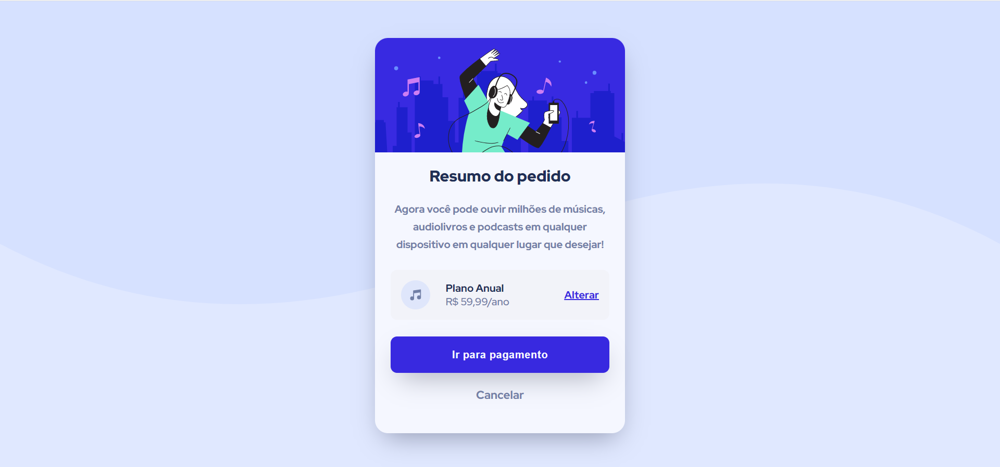

# :bulb: Frontend Mentor - Solução de Desafio

### :zap: O desafio

Os usuários devem ser capazes de:

- Visualizar o layout ideal dependendo do tamanho da tela do dispositivo
- Ver os estados de foco para elementos interativos

### :camera: Captura de tela

Esse é o meu resultado final da solução do desafio :)

### :small_blue_diamond: Links

- URL do site ao vivo: [Clique aqui para ver o projeto hospedado.](https://resumo-do-pedido.vercel.app)

### :wrench: Construído com

- Marcação HTML5 semântica com Emmet
- Propriedades personalizadas de CSS
- Flexbox
- Fluxo de trabalho mobile-first

## :girl: Autor

- Linkedin - [Maria Gabriela Garcia](www.linkedin.com/in/mgabriela-garcia)
- Perfil no Frontend Mentor- [@mgabrielag](https://www.frontendmentor.io/profile/mgabrielag)

## :heart: Agradecimentos

Agradeço ao Frontend Mentor e sua equipe por proporcionar uma forma dos estudantes praticarem o desenvolvimento Front-end. 